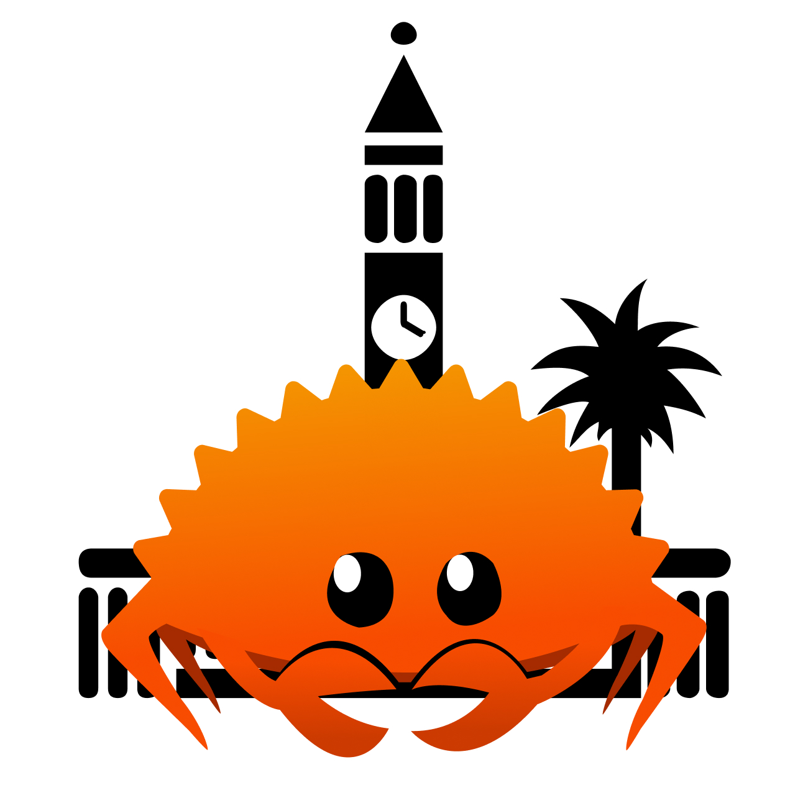

# Welcome to Rust Brisbane

Rust Brisbane is a friendly, inclusive meetup for anyone curious about Rust, whether you’re just getting started or
you’ve been shipping it in production for years.

We aim to meet every second Thursday of the month to hang out, learn, and share what we’re building.
Talks are intentionally wide-ranging: show off your project or hobby, walk us through a bug you hunted down,
share a performance win, a tricky lesson, a neat crate, or what you discovered exploring other languages
and bringing ideas back to Rust. [I want to speak &rarr;](./i_want_to_speak.md)

All experience levels are welcome, and first-time speakers are absolutely encouraged.
If you’ve got something you’re excited about (or stuck on), we’d love to hear it.

Come along and say hi.
